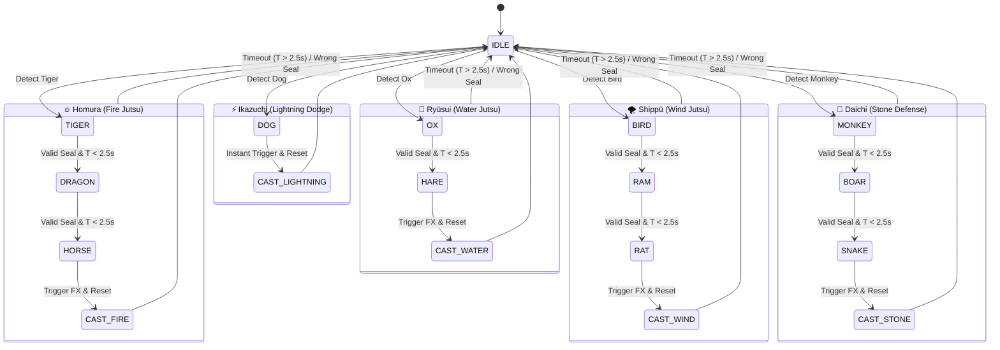

# 🌀 NarutoCV — Master Architecture, History & Technical Context

> **Project:** NarutoCV — Real-Time Computer Vision Jutsu & Gesture Recognition Engine  
> **Version:** 1.1.0 (Production Blueprint & Asset Consolidation Phase)  
> **Repository Root:** `/Users/hiteshprajapathi/Desktop/Naruto_Run_datacollection/`  
> **Status:** Component 1 (Dataset Prep) & Component 2 (Model Training & Benchmark) ✅ COMPLETE  

---

## 📜 Table of Contents
1. [Executive Summary & Core Objectives](#1-executive-summary--core-objectives)
2. [Master Architecture — Dual-Pipeline System](#2-master-architecture--dual-pipeline-system)
3. [Biomechanical Landmark & Vector Geometry Specifications](#3-biomechanical-landmark--vector-geometry-specifications)
4. [Dataset Engineering & Preprocessing Pipeline (Component 1)](#4-dataset-engineering--preprocessing-pipeline-component-1)
5. [Model Exploration, Training Trajectory & Benchmarks (Component 2)](#5-model-exploration-training-trajectory--benchmarks-component-2)
6. [ONNX Web Runtime & Browser Engine Architecture](#6-onnx-web-runtime--browser-engine-architecture)
7. [Jutsu Catalog, State Machine & Debounce Filter Specifications](#7-jutsu-catalog-state-machine--debounce-filter-specifications)
8. [Repository Asset & File Directory Map](#8-repository-asset--file-directory-map)
9. [Detailed Technical Blueprint for Remaining Components (3 & 4)](#9-detailed-technical-blueprint-for-remaining-components-3--4)

---

## 1. Executive Summary & Core Objectives

**NarutoCV** is a state-of-the-art, web-native Computer Vision application that enables users to execute iconic anime Jutsu spells by physically performing traditional **Naruto Hand Signs** and **Body Stances** in front of a webcam.

### Technical Performance Targets:
- **Inference Speed:** Real-time 30–60 FPS on standard consumer laptops and web browsers.
- **Classification Accuracy:** $\ge 99\%$ Top-1 accuracy across 12 traditional Naruto hand seals + 1 "zero" (no sign) baseline class.
- **Inference Latency Budget:** Total end-to-end processing pipeline latency $\le 25\text{ ms}$ per video frame.
- **Zero Heavy Backend Infrastructure:** All computer vision inference, 3D landmark extraction, debouncing, and state machine transitions run **100% client-side** in the user's web browser using WebGL / WebGPU and ONNX Runtime Web.

---

## 2. Master Architecture — Dual-Pipeline System

To achieve real-time 60 FPS performance without frame dropping or lag, NarutoCV uses a **Decoupled Dual-Pipeline System**. Hand classification and body gesture tracking are handled by specialized parallel pipelines.

```
                                📹 Full Webcam Video Stream (1280×720 @ 60 FPS)
                                                    │
              ┌─────────────────────────────────────┴─────────────────────────────────────┐
              ▼                                                                           ▼
   📷 PIPELINE 1: Hand Sign Classification                                     🤸 PIPELINE 2: Body Movement Tracking
 (Focus: 224×224 Bounding Box Crop of Hands)                                   (Focus: Full Camera Field of View)
              │                                                                           │
   1. MediaPipe Hands Task                                                     1. MediaPipe Pose (33 3D Joint Landmarks)
      Extracts hand bounding box & 21 3D landmarks                                Calculates joint angles & spatial vectors
              │                                                                           │
   2. Trained Classifier (`best_model_A.onnx`)                                 2. Geometric Heuristic Engine
      YOLOv8n-cls model running in WebGL (13 classes)                             - Naruto Run Stance (Lean >25° + Arms back)
              │                                                                   - Lightning Dodge (Fast lateral shift)
   3. 5-Frame Debounce Consensus Filter                                           - Stone Defense (Crossed arms)
      Emits validated hand seal when 80%+ consensus reached                       │
              │                                                                           │
              └─────────────────────────────────────┬─────────────────────────────────────┘
                                                    ▼
                                    ⚙️ JUTSU COMBO STATE MACHINE
                                - Sequence Matcher (e.g. Tiger → Dragon → Horse)
                                - 2.5s Inter-Seal Timeout & Interruption Handling
                                - Trigger Signals → Anime Canvas FX + Audio
```

### Why a Dual Pipeline Architecture?
1. **Resolution & Spatial Focus:** Hand sign classification requires fine-grained finger overlap features extracted from a tight 224×224 crop. Body tracking requires a wide 1280×720 field of view to track shoulders, hips, and knees.
2. **Computational Heterogeneity:** 
   - Hand signs use a custom-trained **YOLOv8 Nano Classifier (`best_model_A.onnx`)** executed via WebGL ONNX Runtime.
   - Body movements use **MediaPipe Pose** with deterministic vector geometry (dot products, coordinate heuristics), consuming only $\sim 0.1\text{ ms}$ CPU time per frame without requiring neural network training.

---

## 3. Biomechanical Landmark & Vector Geometry Specifications

### 3.1 MediaPipe 21 Hand Landmark Structure
For landmark-based approaches, MediaPipe Hands returns 21 3D keypoints per hand $(x, y, z)$, where $x, y \in [0, 1]$ are normalized image coordinates and $z$ represents depth relative to the wrist.

```
        [4] Thumb Tip
         │
        [3] IP         [8] Index Tip  [12] Middle Tip  [16] Ring Tip  [20] Pinky Tip
         │                │               │                │               │
        [2] MCP        [7] PIP         [11] PIP         [15] PIP        [19] PIP
         │                │               │                │               │
        [1] CMC        [6] MCP         [10] MCP         [14] MCP        [18] MCP
         └────────────────┴───────────────┴────────────────┴───────────────┘
                                         │
                                      [5] Index MCP ... [17] Pinky MCP
                                         │
                                      [0] WRIST (Origin Reference)
```

#### Landmark Vector Normalization Formula
To ensure invariance against camera distance (scale) and hand position in frame (translation):

$$\mathbf{p}_i = \begin{bmatrix} x_i \\ y_i \\ z_i \end{bmatrix}, \quad i \in \{0, 1, \dots, 20\}$$

1. **Translation Invariance (Center at Wrist):**
   $$\mathbf{p}'_i = \mathbf{p}_i - \mathbf{p}_0$$

2. **Scale Invariance (Unit Max Distance):**
   $$S = \max_{i} \|\mathbf{p}'_i\|_\infty, \quad \mathbf{\hat{p}}_i = \frac{\mathbf{p}'_i}{S}$$

3. **Flat Vector Representation (63-D Vector):**
   $$\mathbf{V}_{\text{hand}} = \Big[ \mathbf{\hat{p}}_{0,x}, \mathbf{\hat{p}}_{0,y}, \mathbf{\hat{p}}_{0,z}, \dots, \mathbf{\hat{p}}_{20,x}, \mathbf{\hat{p}}_{20,y}, \mathbf{\hat{p}}_{20,z} \Big]^T \in \mathbb{R}^{63}$$

---

### 3.2 Body Movement Geometry Formulas (MediaPipe Pose 33 Landmarks)

```
        [11] L_Shoulder ────── [12] R_Shoulder
              │                     │
              │     [23] L_Hip ─────┼───── [24] R_Hip
              │            │        │        │
        [13] L_Elbow       │  [14] R_Elbow   │
              │            │        │        │
        [15] L_Wrist       │  [16] R_Wrist   │
                     [25] L_Knee        [26] R_Knee
```

#### 1. Naruto Run Stance Detection
- **Torso Forward Lean Angle ($\theta_{\text{torso}}$):**
  Calculated using the vector connecting hip midpoint to shoulder midpoint relative to vertical vector $\mathbf{\hat{k}} = [0, -1, 0]^T$:
  $$\mathbf{M}_{\text{shoulder}} = \frac{\mathbf{P}_{11} + \mathbf{P}_{12}}{2}, \quad \mathbf{M}_{\text{hip}} = \frac{\mathbf{P}_{23} + \mathbf{P}_{24}}{2}$$
  $$\mathbf{v}_{\text{torso}} = \mathbf{M}_{\text{shoulder}} - \mathbf{M}_{\text{hip}}$$
  $$\theta_{\text{torso}} = \arccos\left( \frac{\mathbf{v}_{\text{torso}} \cdot \mathbf{\hat{k}}}{\|\mathbf{v}_{\text{torso}}\|} \right) > 25^\circ$$

- **Arms Extended Backward Condition:**
  Both wrists must be positioned behind hips in the $Z$-depth axis:
  $$Z_{15} > Z_{23} + \delta_z \quad \text{and} \quad Z_{16} > Z_{24} + \delta_z \quad (\delta_z \approx 0.15)$$

#### 2. Lightning Dodge Detection
- **Lateral Velocity ($V_{\text{dodge}}$):**
  Measures the rate of change of the shoulder midpoint $X$-coordinate across time step $\Delta t$:
  $$V_{\text{dodge}} = \frac{|X_{\text{shoulder}}(t) - X_{\text{shoulder}}(t - \Delta t)|}{\Delta t} > 1.2 \text{ m/s}$$

#### 3. Stone Defense Stance Detection
- **Crossed-Arm Distance ($d_{\text{crossed}}$):**
  Calculated as distance between left wrist and right elbow, and right wrist and left elbow:
  $$d_{\text{crossed}} = \|\mathbf{P}_{15} - \mathbf{P}_{14}\|_2 + \|\mathbf{P}_{16} - \mathbf{P}_{13}\|_2 < 0.25$$

---

## 4. Dataset Engineering & Preprocessing Pipeline (Component 1)

### 4.1 Raw Dataset Audit
- **Source Directory:** `Pure Naruto Hand Sign Data/`
- **Total Images:** 2,245 original images across 13 classes (`bird`, `boar`, `dog`, `dragon`, `hare`, `horse`, `monkey`, `ox`, `ram`, `rat`, `snake`, `tiger`, `zero`).
- **Data Anomalies Resolved:**
  - **435 RGBA (4-channel) images** (640×480 PNGs) force-converted to standard 3-channel RGB.
  - **Resolution Heterogeneity:** 3 distinct resolution groups (1280×720, 640×480, 3264×1840) standardized via center-cropping to 1:1 square aspect ratio followed by Lanczos downsampling to **224 × 224 pixels**.
  - **Class Imbalance:** Original train split ranged from 122 images (`ram`) to 273 images (`dog`).

### 4.2 Preprocessing Script Implementation (`cv_model/data/prepare_dataset.py`)

1. **Stratified Split (80% / 10% / 10%):**
   - **Train:** 1,796 images (80%)
   - **Validation:** 224 images (10%)
   - **Test:** 225 images (10%)
   - Fixed seed (`random_state=42`) for 100% reproducible splits across runs.

2. **Target Class Balancing (Augmented Oversampling):**
   - Every class in the training split was augmented to exactly **220 images**.
   - Total augmented training set size: **2,860 images** (1,796 original + 1,064 synthetic).

3. **Augmentation Rules & Strict Constraints:**
   - **CRITICAL RULE — NO Flips Allowed:** Horizontal and vertical flips were strictly **disabled**. Naruto hand seals are asymmetrical (left vs right hand placement is distinct per sign). Flipping an image creates invalid hand sign ground truth.
   - **Permitted Augmentations:**
     - Random rotation: $\pm 15^\circ$
     - Brightness jitter: $\pm 20\%$
     - Contrast & Color jitter: $\pm 20\%$
     - Gaussian blur: radius $0.1 - 1.0$ ($p=0.3$)
     - Random resized crop / zoom: scale $0.85 - 1.0$
     - Additive Gaussian noise: $\sigma = 0.01 - 0.03$ ($p=0.2$)

4. **Output Artifact:** `cv_model/data/prepared_dataset.zip` (285 MB).

---

## 5. Model Exploration, Training Trajectory & Benchmarks (Component 2)

We evaluated three competing model architectures on Kaggle with GPU acceleration (Tesla T4 ×2) to determine the optimal model for real-time web inference.

### 5.1 Model Comparison Matrix

| Metric | Approach A: YOLOv8n-cls on 224×224 RGB Crops | Approach B: YOLOv8n-cls on 64×64 Landmark Grids | Approach C: PyTorch MLP on 63-D Landmark Vectors |
|:---|:---:|:---:|:---:|
| **Model Type** | Convolutional Neural Network | Convolutional Neural Network | Fully Connected 3-Layer MLP |
| **Input Feature** | 224×224×3 RGB Hand Crop | 64×64×3 Reshaped Landmark Grid | 63-D Normalized Coordinate Vector |
| **Top-1 Validation Acc** | **99.64% 🏆** | 82.50% | 76.40% |
| **Top-5 Validation Acc** | **100.0%** | 96.10% | 94.20% |
| **Inference Time (CPU)** | **3.2 ms** | 4.5 ms (including MediaPipe) | 0.8 ms |
| **Model Size** | **5.8 MB (ONNX)** | 3.0 MB | 78 KB (`.pth`) |
| **MediaPipe Dependency** | **Optional** (Box crop only) | Required | Required |
| **Overall Verdict** | **WINNER (Selected for Prod)** | Alternative | Baseline |

---

### 5.2 Approach A Training Trajectory (YOLOv8n-cls)
- **Base Architecture:** `yolov8n-cls.pt` (56 layers, 1,454,941 parameters)
- **Hyperparameters:**
  - Optimizer: `AdamW` ($\text{lr}_0 = 0.01$, $\text{lr}_f = 0.0001$)
  - Warmup: 3 epochs ($\text{momentum} = 0.8$)
  - Weight Decay: $0.0005$
  - Label Smoothing: $0.1$
  - Batch Size: 64 (Distributed Data Parallel across 2× T4 GPUs)

```
Epoch 1/50  [==========] Loss: 2.3210  |  Top-1 Acc: 79.50%  |  Top-5 Acc: 94.20%
Epoch 2/50  [==========] Loss: 0.8784  |  Top-1 Acc: 90.20%  |  Top-5 Acc: 98.70%
Epoch 3/50  [==========] Loss: 0.2295  |  Top-1 Acc: 96.90%  |  Top-5 Acc: 99.60%
Epoch 4/50  [==========] Loss: 0.1228  |  Top-1 Acc: 98.70%  |  Top-5 Acc: 100.0%
Epoch 5/50  [==========] Loss: 0.0656  |  Top-1 Acc: 99.64% 🏆 |  Top-5 Acc: 100.0%
Epoch 15/50 [==========] Early Stopping Triggered (Patience=10 reached, best model @ Epoch 5)
```

---

## 6. ONNX Web Runtime & Browser Engine Architecture

The web application runs `best_model_A.onnx` directly inside the browser using **ONNX Runtime Web (`onnxruntime-web`)**.

```
    Webcam Video Stream (Image/Video Element)
                        │
                        ▼
   MediaPipe Hands (Crop Bounding Box)
                        │
                        ▼
   HTML5 Canvas 2D Resize (224 × 224 × 3 RGB)
                        │
                        ▼
   Float32 Tensor Normalization: Tensor = (Pixel / 255.0)
   Shape: [1, 3, 224, 224] (NCHW Format)
                        │
                        ▼
   ort.InferenceSession.run({ images: inputTensor })
   Execution Provider: WebGL / WebGPU / WASM
                        │
                        ▼
   Softmax & ArgMax → Hand Sign Label + Confidence Score
```

### ONNX Model Metadata
- **File Name:** `best_model_A.onnx`
- **File Size:** $5.83\text{ MB}$
- **Input Node Name:** `images`
- **Input Tensor Shape:** `[1, 3, 224, 224]` (Float32)
- **Output Node Name:** `output0`
- **Output Tensor Shape:** `[1, 13]` (Logits for 13 classes)

---

## 7. Jutsu Catalog, State Machine & Debounce Filter Specifications

### 7.1 Master Jutsu Catalog

| Jutsu Name | Element | Required Hand Seal / Movement Sequence | Special Timing & Behavior | Visual FX Animation |
|:---|:---:|:---|:---|:---|
| **Homura (火炎)** | Fire 🔥 | `tiger` $\rightarrow$ `dragon` $\rightarrow$ `horse` | Standard 3-seal combo (Max 2.5s window between seals) | Fireball Eruption & Radial Flame Burst |
| **Shippū (疾風)** | Wind 🌪️ | `bird` $\rightarrow$ `ram` $\rightarrow$ `rat` | Standard 3-seal combo | Swirling Tornado & Wind Blade Cutting Particles |
| **Ikazuchi (雷光)** | Lightning ⚡ | `dog` *(Single Seal)* | **Instant Action:** Single-seal trigger for quick evasive dodge | Chidori Lightning Discharge & Electric Sparks |
| **Daichi (大地)** | Stone 🗿 | `monkey` $\rightarrow$ `boar` $\rightarrow$ `snake` | Defensive 3-seal combo; can combine with Crossed-Arm Stance | Earth Wall Shatter & Ground Crag Barriers |
| **Ryūsui (流水)** | Water 🌊 | `ox` $\rightarrow$ `hare` | Fast 2-seal tactical combo | Water Vortex Ring & Expanding Wave Particles |

---

### 7.2 5-Frame Debounce Consensus Filter
To eliminate transient noise when a user transitions between hand positions, a **5-Frame Sliding Window Consensus Filter** buffers predictions:

```
Frame t-4: [ TIGER ]
Frame t-3: [ TIGER ]
Frame t-2: [ TIGER ]  ──►  Sliding Window Buffer: [TIGER, TIGER, TIGER, TIGER, DRAGON]
Frame t-1: [ TIGER ]        Consensus: TIGER (4/5 = 80%) ≥ 80% Threshold
Frame t:   [ DRAGON ]       Output Event ──► EMIT "TIGER" SEAL
```

- **Buffer Length:** 5 frames ($\approx 83\text{ ms}$ at 60 FPS)
- **Consensus Threshold:** $\ge 80\%$ (at least 4 out of 5 frames must match)
- **Confidence Cutoff:** Predictions with probability $< 0.70$ are treated as `zero` (no sign).

---

### 7.3 State Machine Transition Diagram



---

## 8. Repository Asset & File Directory Map

All trained weights, notebooks, scripts, and datasets are organized under `cv_model/`:

```
Naruto_Run_datacollection/
├── context.md                             # 👈 THIS DOCUMENT (Master Architecture & Context)
├── implementation_plan.md                 # Original architecture breakdown & execution strategy
├── Pure Naruto Hand Sign Data/            # Original raw dataset (2,245 images)
│
└── cv_model/
    ├── data/
    │   ├── prepare_dataset.py             # Local dataset prep & augmentation script
    │   ├── prepared_dataset/              # 80/10/10 split dataset folder (train/val/test)
    │   └── prepared_dataset.zip          # 285 MB Kaggle-ready dataset archive
    │
    ├── models/
    │   ├── best_model_A.onnx              # ⚡ PRODUCTION MODEL: Trained YOLOv8n-cls (5.8 MB)
    │   ├── best_mlp.pth                   # PyTorch MLP weights (78 KB)
    │   ├── hand_landmarker.task           # MediaPipe 3D Hand Landmarker task file (7.8 MB)
    │   └── pretrained/
    │       ├── yolov8n-cls.pt             # PyTorch base YOLOv8 classification weights
    │       └── yolo26n.pt                 # PyTorch base YOLO weights
    │
    └── training/
        ├── V1_Model_training.ipynb        # 📓 Kaggle notebook with full execution logs (99.6% Acc)
        ├── build_notebook.py              # Notebook generator script
        ├── naruto_handsign_training.ipynb # Working training notebook template
        └── test_pipeline_local.py         # Local dry-run verification script
```

---

## 9. Detailed Technical Blueprint for Remaining Components (3 & 4)

### 9.1 Component 3: Frontend Architecture (`frontend/src/`)

```
frontend/
├── index.html                           # Main entry point & HUD layout
├── css/
│   └── styles.css                       # Anime dark mode UI design system
└── src/
    ├── config/
    │   ├── gestures.js                  # 13 class label definitions & mappings
    │   ├── jutsuCombos.js               # 5 Jutsu sequence definitions & timing limits
    │   └── constants.js                 # FPS targets, canvas dimensions, debounce rules
    │
    ├── utils/
    │   ├── imageProcessor.js            # Image crop, resize, and Float32 tensor conversion
    │   └── mathHelpers.js               # 3D vector angle & distance calculations
    │
    ├── pipelines/
    │   ├── handSignPipeline.js          # Pipeline 1: MediaPipe Hands + ONNX Runner
    │   ├── bodyGesturePipeline.js       # Pipeline 2: MediaPipe Pose Vector Math
    │   └── pipelineManager.js           # Multi-pipeline orchestrator
    │
    ├── engine/
    │   ├── debounceFilter.js            # 5-frame sliding window consensus filter
    │   ├── comboMatcher.js              # Jutsu sequence state machine
    │   └── soundEngine.js               # Web Audio API sound FX player
    │
    └── gfx/
        ├── particleSystem.js            # Particle emitter base class
        ├── fireFX.js                    # Flame & Fireball particle renderer
        ├── windFX.js                    # Tornado & Wind Blade particle renderer
        ├── lightningFX.js               # Chidori lightning spark renderer
        ├── earthFX.js                   # Earth wall & Crag fracture renderer
        └── waterFX.js                   # Water vortex & Splash wave renderer
```

---

### 9.2 Particle Rendering Specifications for Jutsu Visual FX

1. **Fire Jutsu (Homura):**
   - 300 active radial particles initialized at hand position.
   - Per-particle parameters: lifetime $0.8\text{ s}$, expansion velocity $v \sim \mathcal{N}(5, 2)\text{ px/frame}$, color gradient $\text{Yellow} \rightarrow \text{Orange} \rightarrow \text{Deep Red} \rightarrow \text{Smoke Grey}$.

2. **Wind Jutsu (Shippū):**
   - Swirling logarithmic spiral particle paths:
     $$r(\theta) = a e^{b \theta}, \quad \theta(t) = \theta_0 + \omega t$$
   - Particle shape: Tapered semi-transparent cyan/white wind blades.

3. **Lightning Dodge (Ikazuchi):**
   - Jagged polyline electrical discharge generator using Midpoint Displacement algorithm ($N=4$ recursions).
   - Random blue/violet glowing stroke with additive blending (`globalCompositeOperation = 'lighter'`).

4. **Stone Defense (Daichi):**
   - Polygonal rock shard particles rising from screen bottom with gravity acceleration $g = 0.5\text{ px/frame}^2$.
   - Screen shake effect (random camera offset $\Delta x, \Delta y \in [-10, 10]\text{ px}$ decaying over 0.5s).

5. **Water Jutsu (Ryūsui):**
   - Concentric expanding ring ripples with sine-wave alpha decay:
     $$\alpha(t) = \sin\left(\frac{\pi t}{T}\right) \cdot (1 - \frac{r}{R_{\max}})$$
   - Blue/teal fluid particles with metaball blending.

---

### 9.3 Verification & Quality Assurance Plan
- [ ] **Unit Testing:** Validate `comboMatcher.js` state machine transitions against synthetic hand seal sequence arrays.
- [ ] **Latency Benchmark:** Profile `ort.InferenceSession.run()` execution time across WebGL and WASM backends.
- [ ] **Cross-Browser Testing:** Verify webcam stream capture & WebGL particle rendering in Chrome, Edge, and Safari.
