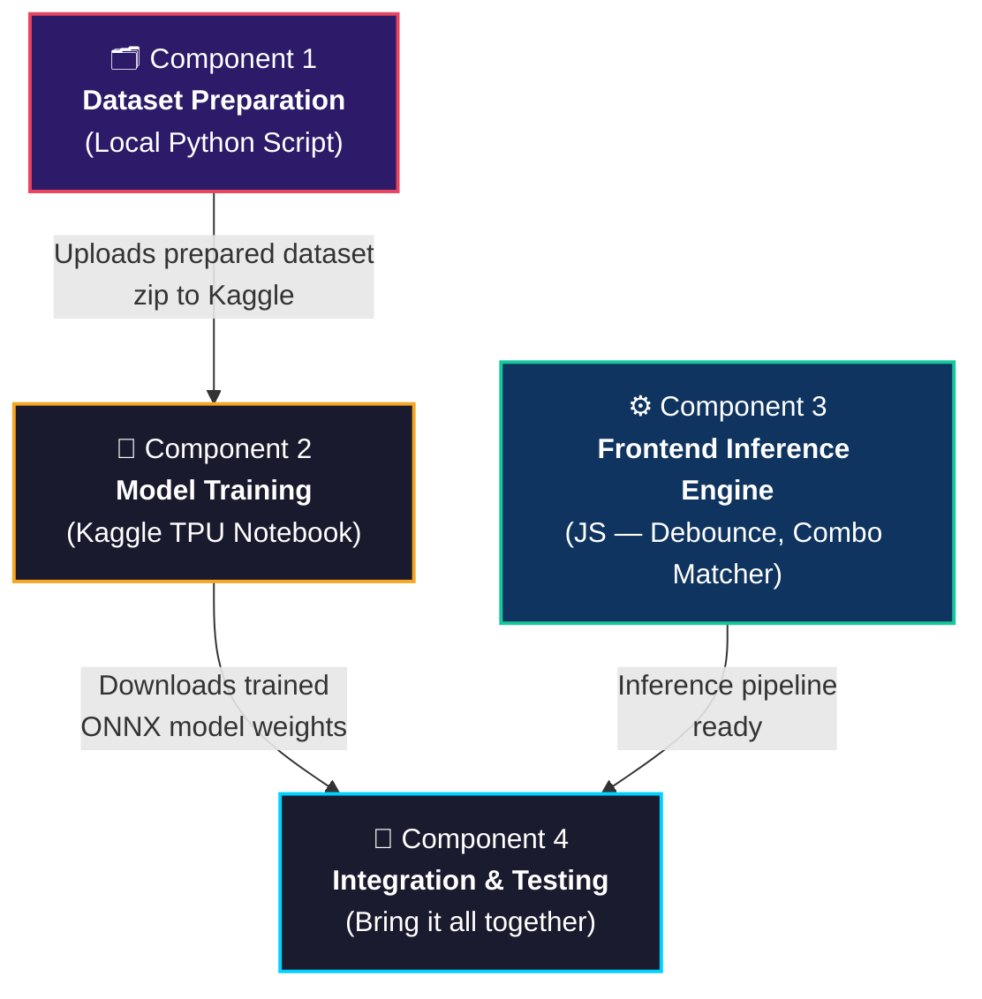

# NarutoCV — Modular Component Breakdown & Dependency Analysis

---

## 🧩 Component Overview

The project is divided into **4 independent components**. Each component is self-contained with clear inputs and outputs.



---

## 📋 Dependency Analysis

> [!IMPORTANT]
> **Can the notebook be created first?**
>
> **YES — the notebook can be written right now**, but it **cannot be executed** until Component 1 produces the prepared dataset. Here's why:
>
> The training notebook expects images organized in a specific folder structure (`train/`, `val/`, `test/` with class subdirectories). The raw dataset currently has an imbalanced 2,159/86 train/test split with no validation set. Component 1 merges, re-stratifies, and augments this into the format the notebook needs.
>
> **However**, Component 1 is a single Python script that runs in ~30 seconds locally. So the workflow is:
> 1. ✍️ Write the notebook now (Component 2)
> 2. ⚡ Run Component 1 locally (takes 30 seconds)
> 3. 📤 Upload the prepared dataset zip to Kaggle
> 4. 🚀 Execute the notebook on Kaggle TPU

### Full Dependency Matrix

| Component | Depends On | Can Build Now? | Can Execute Now? |
| :--- | :--- | :---: | :---: |
| **C1: Dataset Prep** | Raw dataset (already exists ✅) | ✅ Yes | ✅ Yes |
| **C2: Training Notebook** | C1 output (prepared dataset zip) | ✅ Yes (write it) | ❌ No (needs C1 output first) |
| **C3: Frontend Inference** | Nothing — independent | ✅ Yes | ✅ Yes |
| **C4: Integration** | C2 output (model weights) + C3 (inference engine) | ❌ No | ❌ No (needs C2 + C3) |

### Parallel Execution Plan

```mermaid
gantt
    title Build & Execution Timeline
    dateFormat X
    axisFormat %s

    section Write Code
    C1 Dataset Prep Script      :c1w, 0, 1
    C2 Training Notebook        :c2w, 0, 3
    C3 Frontend Inference       :c3w, 0, 3

    section Execute
    Run C1 locally (30s)        :c1e, 1, 2
    Upload dataset to Kaggle    :up, 2, 3
    Run C2 on Kaggle TPU        :c2e, 3, 5
    C4 Integration              :c4, 5, 7
```



**Key insight:** Components 1, 2, and 3 can all be **written** in parallel. Only **execution** has the dependency chain: C1 → upload → C2.

---

## 📦 Component 1: Dataset Preparation (Local Script)

**What:** A single Python script that runs on your local machine.

**File:** `cv_model/data/prepare_dataset.py`

**Input:** Raw dataset at `Pure Naruto Hand Sign Data/` (existing `train/` and `test/` folders)

**What it does:**
1. Merges `train/` (2,159 images) and `test/` (86 images) into one unified pool
2. Creates a stratified **80% / 10% / 10%** train/val/test split across all 13 classes
3. Resizes all images to **224 × 224 pixels**
4. Applies data augmentation to the training split only:
   - Random rotation ±15°
   - Brightness jitter ±20%
   - Slight zoom ±10%
   - Gaussian blur (mild)
5. Packages the result into a clean folder structure and a **ZIP file** ready for Kaggle upload

**Output:**
```
cv_model/data/prepared_dataset/
├── train/
│   ├── bird/        (≈142 original + augmented images)
│   ├── boar/
│   ├── dog/
│   ├── dragon/
│   ├── hare/
│   ├── horse/
│   ├── monkey/
│   ├── ox/
│   ├── ram/
│   ├── rat/
│   ├── snake/
│   ├── tiger/
│   └── zero/
├── val/
│   ├── bird/        (≈18 images)
│   └── ...
├── test/
│   ├── bird/        (≈18 images)
│   └── ...
└── dataset_stats.json   (class counts, split ratios, augmentation log)
```
Plus: `prepared_dataset.zip` — ready to upload to Kaggle.

**Runtime:** ~30 seconds locally.

---

## 📦 Component 2: Model Training Notebook (Kaggle TPU)

**What:** A self-contained `.ipynb` Jupyter notebook designed to run on Kaggle with TPU/GPU.

**File:** `cv_model/training/naruto_handsign_training.ipynb`

**Input:** The `prepared_dataset.zip` uploaded as a Kaggle dataset.

**What it does (structured as notebook sections):**

| Section | Description |
| :--- | :--- |
| **1. Setup & Config** | Install dependencies (`ultralytics`, `mediapipe`, `onnx`), set device (TPU/GPU), define constants |
| **2. Load Dataset** | Unzip and validate the prepared dataset, print class distribution |
| **3. Approach A — YOLOv8n-cls on Cropped Images** | Train YOLOv8 Nano classifier directly on the 224×224 hand sign images |
| **4. Approach B — YOLOv8n-cls on Landmark Grids** | Extract MediaPipe landmarks, reshape to feature grid, train YOLOv8n |
| **5. Baseline C — MLP on Landmark Vectors** | Train a 3-layer MLP (128→64→13) on raw 126-D landmark vectors |
| **6. Evaluation & Comparison** | Confusion matrices, per-class F1, accuracy table, latency measurements |
| **7. Model Export** | Export best model to ONNX format, download weights |

**Output:**
- `best_model.onnx` — trained model weights in ONNX format
- `training_results.json` — accuracy, F1, latency metrics for all 3 approaches
- Confusion matrix plots
- Comparison summary table

---

## 📦 Component 3: Frontend Inference Engine (Local JS)

**What:** The real-time inference pipeline, debounce filter, and Jutsu combo matcher — all in JavaScript. **Completely independent** of the training pipeline.

**Files:**
```
frontend/src/
├── config/
│   ├── gestures.js              # 13 hand sign class definitions
│   ├── jutsuCombos.js           # 5 confirmed Jutsu sequences
│   └── constants.js             # Timing thresholds, FPS targets
│
├── pipelines/
│   ├── handSignPipeline.js      # Pipeline 1: MediaPipe → crop → classify
│   ├── bodyGesturePipeline.js   # Pipeline 2: (future — stub only)
│   └── pipelineManager.js       # Orchestrates pipelines
│
└── engine/
    ├── debounceFilter.js        # 5-frame sliding window smoother
    ├── comboMatcher.js          # Jutsu sequence state machine
    └── comboQueue.js            # FIFO ring buffer for detected seals
```

**Input:** None — this is pure logic code.

**What it does:**
- Implements the temporal debounce filter (5-frame window, 80% consensus)
- Implements the Jutsu combo state machine (IDLE → MATCHING → TRIGGERED / TIMEOUT / BROKEN)
- Defines the 5 Jutsu sequences with their timing parameters
- Provides the pipeline orchestration layer that will later load the ONNX model

**Can be built and tested independently** using mock classification outputs (no real model needed for unit testing the combo logic).

---

## 📦 Component 4: Integration & Testing

**What:** Bring the trained model (from C2) and the inference engine (from C3) together into a working real-time system.

**Depends on:** C2 (model weights) + C3 (inference code)

**What it does:**
1. Load the ONNX model into the frontend via ONNX Runtime Web
2. Wire up the webcam → MediaPipe → crop → ONNX model → debounce → combo matcher pipeline
3. End-to-end testing: can each Jutsu be reliably triggered?
4. Performance profiling: measure actual FPS in Chrome

---

## 🎯 Recommended Execution Order

```
Step 1:  Write C2 notebook + C3 inference engine (in parallel)  ← START HERE
            ↓                           ↓
Step 2:  Run C1 locally (30s)       Continue C3 dev
            ↓
Step 3:  Upload zip to Kaggle
            ↓
Step 4:  Execute C2 notebook on Kaggle TPU
            ↓
Step 5:  Download best_model.onnx
            ↓
Step 6:  C4 — Integrate model + inference engine
```

> [!TIP]
> **I'll deliver the notebook (C2) and the dataset prep script (C1) first.** You run C1 locally, upload to Kaggle, and execute C2. Meanwhile I can build C3 (frontend inference engine) in parallel since it has no dependencies.

---

## ✅ Decision Required

> [!IMPORTANT]
> **Approve this component breakdown**, and I will proceed to deliver:
> 1. **Component 1** — `prepare_dataset.py` (local script, run first)
> 2. **Component 2** — `naruto_handsign_training.ipynb` (Kaggle notebook)
>
> Then while you're training on Kaggle, I'll build **Component 3** (frontend inference engine).
